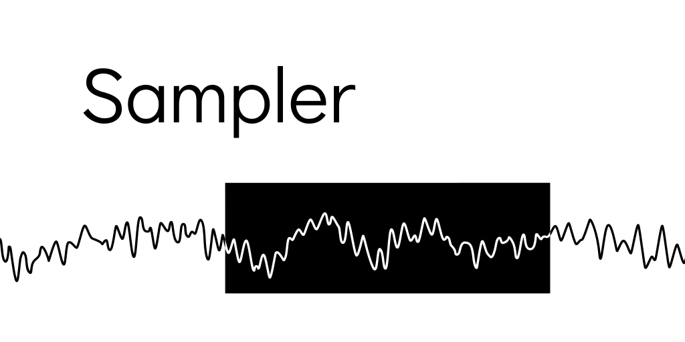

<p align="center">
    
</p>

# Sampler
## Using Sampler
Sampler currently not available on Maven central, but you can use Sampler by simply installing it to your local Maven repository:

```sh
# Install Sampler to local Maven repo
git clone https://github.com/MangoPlex/Sampler.git
cd Sampler
mvn install
```

## Hello world with Sampler
```java
SamplerContext ctx = new SamplerContext();

// Play pure sine wave for 5 seconds
Oscillator osc = new Oscillator();
osc.frequency.value = 440.0; // 440.0 Hz

Speaker speaker = new Speaker(ctx);

osc.connectTo(speaker);
speaker.nextSeconds(5);
```

## Extending Sampler
Not enough nodes? You can make your own by either extending ``Node`` for simple math-related audio node, or ``BufferedNode`` if you want to do more things related to frequency domain

```java
class Noise extends Node {
    
    @Override
    public double sampleAt(SamplerContext ctx, long index, int channelNo) {
        return Math.random() * 2 - 1;
    }

    @Override
    public void resetThisNode() {
        // Reset internal values here...
    }
}
```